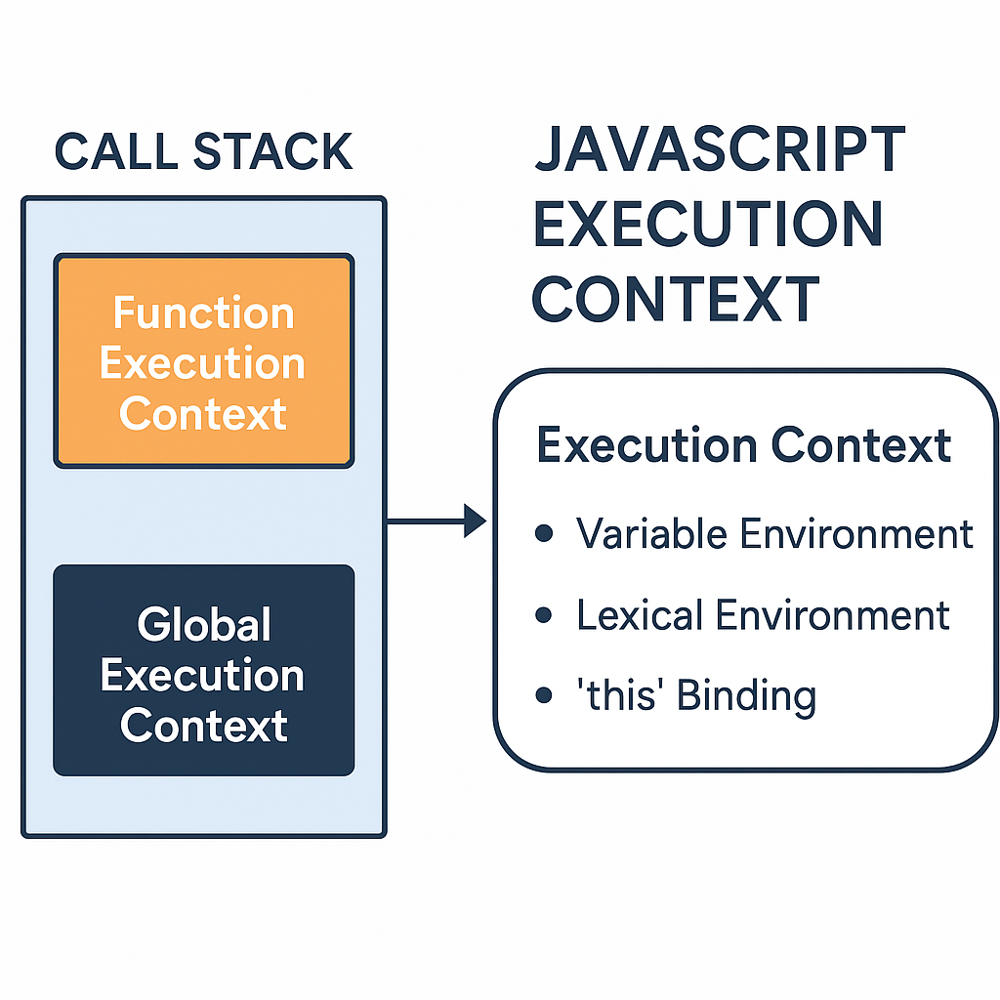

Great! Let’s break down the **JavaScript Execution Context** in a clear and beginner-friendly way. It’s a fundamental concept that helps you understand **how JavaScript code runs** behind the scenes.

---

## 🔹 What is an **Execution Context** in JavaScript?

An **execution context** is like a **container or environment** where JavaScript code is **evaluated and executed**. It defines the **scope**, **variable access**, and **how functions are executed**.

---

## 🔸 Types of Execution Context

1. ### **Global Execution Context (GEC)**
   - Created by **default** when your script starts.
   - It:
     - Creates the global `window` object (in browsers) or `global` (in Node.js).
     - Sets `this` to the global object.
   - Only one **Global Execution Context** exists at a time.

2. ### **Function Execution Context (FEC)**
   - Created **each time a function is called**.
   - Each function has its own:
     - Scope
     - `arguments` object
     - `this` keyword

3. ### **Eval Execution Context** *(rarely used)*
   - Created when code is executed inside the `eval()` function.
   - **Not recommended** in modern JavaScript.

---

## 🔸 Phases of Execution Context

Every context goes through **two main phases**:

### 1. **Creation Phase**
   - The **scope chain** is created.
   - **Variables and functions are hoisted**:
     - Variables are set to `undefined`.
     - Functions are loaded entirely into memory.

### 2. **Execution Phase**
   - The code runs line by line.
   - Variables get assigned values.
   - Functions are invoked.

---

## 🔸 Execution Stack (Call Stack)

JavaScript uses a **stack data structure** to manage execution contexts:

1. Global context is pushed first.
2. When a function is called, a new context is **pushed** onto the stack.
3. When the function finishes, its context is **popped** off the stack.

---

## 🔹 Quick Example:

```javascript
var name = "Nikhil";

function greet() {
  var message = "Hello, " + name;
  console.log(message);
}

greet();
```

### 🔸 What happens behind the scenes?

- **Global Execution Context is created**
  - `name` is hoisted → set to `undefined` initially
  - `greet` function is hoisted

- During execution phase:
  - `name` is assigned `"Nikhil"`
  - `greet()` is called → new **Function Execution Context** is created
  - `message` is created and logged

---

## 💡 Summary:

- **Execution Context = Environment where JS code runs**
- Two main types: Global and Function
- Each context goes through **Creation + Execution**
- Managed using the **Call Stack**

---

Would you like a **diagram or animation-based explanation** too? I can also quiz you to help remember it better!




